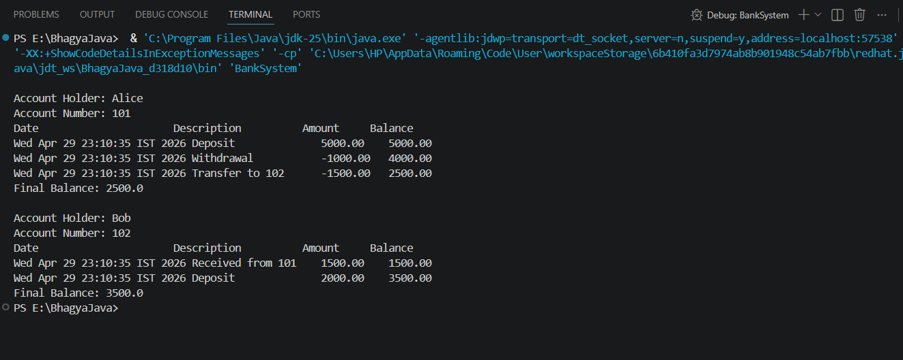

A simple Java mini-project for managing bank accounts and transactions

Bank Account Management System (Java)

Overview

This is a Java-based Bank Account Management System that allows users to perform banking operations
such as deposit, withdrawal, and fund transfer.It also includes an Account Statement Generator to track
all transactions with date, description, and updated balance.

Features

* Deposit money
* Withdraw money
* Transfer funds between accounts
* Track transaction history
* Generate account statements

 Technologies Used

* Java
* OOP Concepts (Classes, Objects, Encapsulation)
* Collections (ArrayList)

Project Structure
Bank-Account-System/
├── src/
│ ├── BankAccount.java
│ ├── BankSystem.java
│ └── Transaction.java
├── images/
│ └── output.png

How to Run

1. Open terminal in project folder

2. Compile:
   javac src/*.java

3. Run:
   java -cp src BankSystem

Sample Output



Future Improvements

* GUI using JavaFX/Swing
* Database integration
* User login system

-Author
Bhagyashri Math

# Bank Account System

A Java-based banking application with both console and web-based interfaces. Users can create accounts, perform deposits, withdrawals, and transfers between accounts while maintaining a transaction history.

## Project Structure

Bank-Account-System/
├── BankSystem.java              # Console application main class
├── BankAccount.java             # Bank account model (console)
├── Transaction.java             # Transaction model (console)
├── index.jsp                     # Web application UI
├── WEB-INF/
│   ├── web.xml                  # Deployment descriptor
│   └── classes/                 # Compiled Java classes
├── src/
│   └── com/bank/
│       ├── model/
│       │   ├── BankAccount.java      # Bank account model (web)
│       │   └── Transaction.java      # Transaction model (web)
│       └── servlet/
│           └── BankSystemServlet.java # Request handler
└── images/                      # Project images directory

## Features

- **Account Management**: Create bank accounts with account holder name and number
- **Transactions**: Deposit, withdraw, and transfer funds between accounts
- **Transaction History**: View complete transaction statements with dates and balances
- **Dual Interface**: 
  - Console-based application for command-line use
  - Web-based application with form UI

## Running the Application

### Console Application

1. Compile the Java files:
   ```bash
   cd e:\BhagyaJava\Bank-Account-System
   javac BankAccount.java Transaction.java BankSystem.java
   ```

2. Run the application:
   ```bash
   java BankSystem
   ```

### Web Application

1. **Option 1: Using Apache Tomcat**
   - Download and install Apache Tomcat 9.0+
   - Deploy the project to Tomcat's webapps directory
   - Start Tomcat
   - Open browser: `http://localhost:8080/Bank-Account-System/`

2. **Option 2: Using an IDE**
   - Import the project into Eclipse or IntelliJ IDEA
   - Configure a Tomcat server in your IDE
   - Deploy and run

3. **Compilation (if not already compiled)**
   ```bash
   javac -cp <path-to-tomcat>\lib\servlet-api.jar -d WEB-INF\classes src\com\bank\model\*.java src\com\bank\servlet\*.java
   ```

## Application Workflow

### Console Version
- Creates two sample accounts (Alice and Bob)
- Performs sample transactions (deposits, withdrawals, transfers)
- Displays account statements with full transaction history

### Web Version
- Fill in account details (name, account number, initial deposit)
- Select transaction type (Create Account, Deposit, Withdraw, Transfer)
- View all active accounts and their transaction history on the same page
- All data is maintained in the HTTP session

## Sample Output

Account Holder: Alice
Account Number: 101
Date                      Description          Amount     Balance
Sat May 09 11:15:22 IST 2026 Deposit              5000.00    5000.00
Sat May 09 11:15:22 IST 2026 Withdrawal           -1000.00   4000.00
Sat May 09 11:15:22 IST 2026 Transfer to 102      -1500.00   2500.00
Final Balance: 2500.0

Account Holder: Bob
Account Number: 102
Date                      Description          Amount     Balance
Sat May 09 11:15:22 IST 2026 Received from 101    1500.00    1500.00
Sat May 09 11:15:22 IST 2026 Deposit              2000.00    3500.00
Final Balance: 3500.0

## Technology Stack

- **Language**: Java
- **Web Framework**: JSP (JavaServer Pages)
- **Servlet Container**: Apache Tomcat
- **Server Configuration**: web.xml deployment descriptor

## Requirements

- Java Development Kit (JDK) 8 or higher
- Apache Tomcat 9.0+ (for web application)
- Modern web browser (for web interface)

## Usage Examples

### Console - Creating Accounts
```java
BankAccount acc1 = new BankAccount("Alice", 101);
acc1.deposit(5000);
acc1.withdraw(1000);
```

### Web - Form Submission
- Account Holder Name: John
- Account Number: 103
- Action: Create / Update Account
- Initial Deposit: 2000

## Notes

- Session-based data storage (data persists during user session)
- Transaction timestamps are recorded automatically
- Insufficient funds prevents withdrawal/transfer operations
- All monetary values are displayed with 2 decimal places

## Project Status

✅ Console application: Fully functional
✅ Web application: Fully functional
✅ Deployment-ready

## Support

For issues or improvements, review the source code in the respective directories:
- Console logic: `BankSystem.java`, `BankAccount.java`, `Transaction.java`
- Web logic: `src/com/bank/` directory

