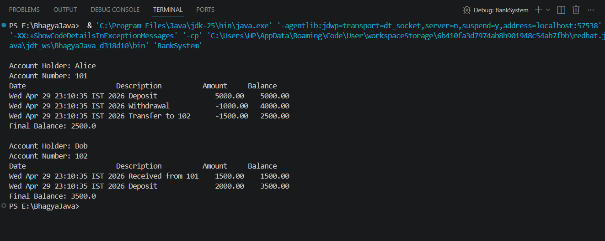

A simple Java mini-project for managing bank accounts and transactions

Bank Account Management System (Java)

Overview

This is a Java-based Bank Account Management System that allows users to perform banking operations
such as deposit, withdrawal, and fund transfer.It also includes an Account Statement Generator to track
all transactions with date, description, and updated balance.

Features

* Deposit money
* Withdraw money
* Transfer funds between accounts
* Track transaction history
* Generate account statements

 Technologies Used

* Java
* OOP Concepts (Classes, Objects, Encapsulation)
* Collections (ArrayList)

Project Structure
Bank-Account-System/
├── src/
│ ├── BankAccount.java
│ ├── BankSystem.java
│ └── Transaction.java
├── images/
│ └── output.png

How to Run

1. Open terminal in project folder

2. Compile:
   javac src/*.java

3. Run:
   java -cp src BankSystem

Sample Output

Future Improvements

* GUI using JavaFX/Swing
* Database integration
* User login system

-Author
Bhagyashri Math
